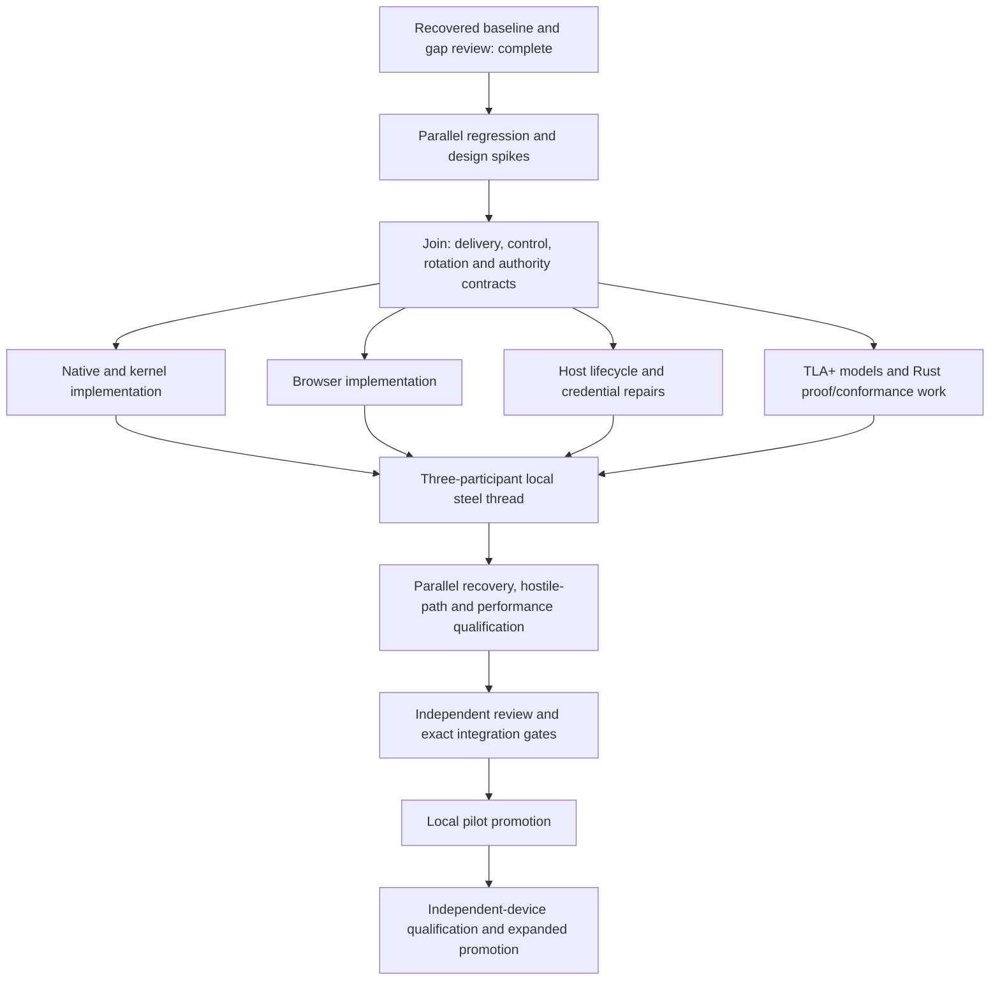

# Valhalla: private-room production readiness and formal assurance

Date: 23 September 2026. Status: implementation and qualification in progress.
See the [execution record](readiness-execution-2026-09-23.md) for completed checks,
review findings, remaining gates and the current promotion boundary.

## Decision

Continue the existing private-room product through a three-participant steel thread that includes membership changes, interrupted delivery and mailbox rotation. Repair the concrete recovery and host-maintenance gaps below before widening deployment. Use TLA+/TLC to challenge the distributed state machines, extend the existing Kani/Verus/Hegel foundation, and evaluate Lean on one small theorem before adopting another maintained toolchain.

The immediate product target remains the user's mostly persistent Mac host, existing Codex/Devin agents and browser clients. A sleeping or logged-out Mac is an expected outage. Independent-device qualification is a separate promotion gate. Always-on public hosting, install-free mobile networking, OS-enforced agent containment and new dead-owner recovery authority are separate projects.

## Recovered context and audited baseline

- Devin session: `valhalla`, ID `roan-color`, main chain `9829`; latest substantive response 2026-09-23 09:50:15 UTC. Transcript: `/Users/benguo/.local/share/devin/cli/transcripts/roan-color.json`. Predecessors: `cuboid-viburnum` and `near-mochi`.
- Continue in `/private/tmp/valhalla-steel-20260922`. The recovered checkout was clean on `main` at `897bc6b`. This planning branch is `codex/readiness-formal-plan-20260923`, based on fetched `origin/main` `ba00721c07078f5e5aca3bd879941287a417c0b7`. The two intervening commits only update site installer/version links. Existing other worktrees are preserved.
- [PR #91](https://github.com/hraness/valhalla/pull/91), merge `cf5fc15`, integrated the private kernel, relay/host, MCP, browser, performance and steel-thread repairs. [PR #94](https://github.com/hraness/valhalla/pull/94) records the release and installation evidence.
- [v0.2.3](https://github.com/hraness/valhalla/releases/tag/v0.2.3) is published. Fresh inspection finds all eight assets, and ordinary `gh release download` successfully retrieves the macOS CLI checksum sidecar. The transcript's late tag-index/download failure is no longer observed. This check did not redownload every archive or requalify the installed binaries.
- Fresh current-main check inspection found 66 completed, successful checks; [Rust run 35848111842](https://github.com/hraness/valhalla/actions/runs/35848111842) succeeded. The `main_policy` custom property was not evidence of enforcement; the subsequent [policy audit and restoration](main-policy.md) closes that discrepancy. PR #93's installer work has landed; only #84 was open at inspection.
- The prior deployment record reports v0.2.3 installed, host `127.0.0.1:9473`, browser gateway `127.0.0.1:8790`, authenticated empty-page success and mailbox head zero. These are historical installation observations, not a fresh real-message or remote qualification in this review.
- The earlier explicit decision to remove Platonik remains in force.

Three parallel investigations recovered session history, audited private-room code, and assessed formal methods; a subsequent lane reviewed host maintenance. This pass read source and current GitHub state. It did not execute new cargo/browser/formal checks, install tools, modify product code, or operate user services.

## What already exists

The product is well beyond an initial prototype. Maintained Rust crates implement MLS membership and encrypted messages, owner/device authority, ordered controls, removal and succession, fork quarantine, atomic persistence, durable sent/acceptance indexes, read-only archive recovery, scoped TLS relay access, bounded durable delivery, MCP grants, a local Mac host and browser gateway. Real local browser/storage journeys and two-agent process/restart tests exist.

The kernel verifies and persists member acceptance. The browser gap is exposing this evidence through worker/UI state, not inventing a second cryptographic verifier. Renewal, host rotation, credential addition, gateway supervision, typed refusals, adaptive polling and long-grant improvements also exist. Several older readiness pages and the prior finding table mix implemented mechanisms with unmet end-to-end promotion criteria. Reconcile these records; do not rebuild completed features from stale prose.

Assurance already includes production-code Kani spent-nonce checks, an unbounded Verus ledger reference-model proof, Hegel stateful tests, property tests, crash tests, browser qualification and release artifact checks. Each establishes a specific claim with limits.

## Prioritized findings

These are source-review findings unless explicitly labeled as live observations. First implementation task for each defect is a failing regression or counterexample. Severity reflects the intended next deployment, not a claim that every scenario has already occurred.

| ID / priority | Current gap and evidence | Required closure |
| --- | --- | --- |
| R1 / P1 | Browser `classify_receive` treats `FutureEpoch` and both ratchet-gap directions as terminal `Skip` (`browser/src/private/delivery_engine.rs:122-127`). Kernel future-epoch errors require pending controls first (`engine/messages.rs:151-156`); native future/ahead/control gaps retry (`agent_delivery.rs:855-859`). Browser advancement can strand a recoverable item outside normal polling. | Shared classification contract; bounded durable deferral and separate fetched/resolved progress; out-of-order control/message, restart and overflow tests on both clients. Retained relay bytes do not alone provide a supported retry path. |
| R2 / P1 | Membership addition stores the encrypted control as a `Control` record while putting the invitation in the outbox (`membership.rs:270-280`). Relay kinds and outbox drains do not provide the corresponding control-delivery path; browser actions explicitly request file transfer (`panel/actions.rs:581`). The two-agent happy path hides this seam. | A third participant joins through confidential admission; existing members receive the authenticated control automatically and converge. Duplicate, missing and competing controls must not silently alter membership. |
| R3 / P1 | Host `rotate` selects a new namespace and empty mailbox (`private_host/config.rs:625-649`). Existing native endpoint identity includes namespace and refuses a changed binding (`relay/delivery.rs:56-78,350-355`). Browser delivery is selected by profile/room but bound immutably to namespace (`delivery.rs:60-76,195`; `delivery_engine.rs:185-202`). Rotation currently requires fresh state and does not redirect queues. | Explicit multi-generation drain/cutover contract, durable pending-job disposition, old/new receipt identity, compatible browser/native migration, and tiny-capacity fault tests. No copying queues to reset quota or re-encrypting existing jobs. |
| R4 / P1 | Leaf renewal derives lifetime from latest expiry minus original creation time, then changes expiry without creation time (`config.rs:679-682,716-717`): successive renewals can lengthen the chosen lifetime. It can cap leaf expiry to CA expiry although strict loading rejects equality (`config.rs:332`). | Persist the intended validity duration; inject time; test repeated renewal and CA-boundary behavior. Validate the complete proposed sealed configuration before publication; every successful renewal must remain loadable. |
| R5 / P1 | Sealed-config recovery restores backup files using consuming renames (`config.rs:493-505`), while recovery needs the backup set/config (`519-536`). Recovery interrupted during recovery needs an explicit convergence contract. | Fault injection at every restore boundary; repeated recovery must reach one valid old/new selection or preserve actionable uncertainty. Never discard custody or repair by rewriting manifests from assumptions. |
| R6 / P1 | Installed host supports add-credential, mailbox rotation and leaf renewal, but no selected credential revoke/replace. Service enumerates all configured IDs with PUT/PAGE (`private_host.rs:181-194`); configuration has IDs without active/revoked generations (`config.rs:44-60`). | Explicit per-credential lifecycle preserving stable quota identity, bounded overlap where selected, restart and immediate/next-reopen semantics. Room removal and transport-token revocation are distinct. |
| R7 / P2 | Browser does not expose durable member acceptances through its worker/UI; finite delivery-attempt limits also have no complete same-room continuation UX. | Truthful queued/retained/member-accepted/uncertain/refused/expired states; show the exact accepting member and message binding. Resume/rearm cannot silently replenish authority or reset replay protection. |
| R8 / P2 | Gateway supervision/drain exists, but a joined worker panic sets failure and exits the accept loop (`relay/http.rs:256-263,316-317`), contrary to the previous promotion criterion. Root HTTP probe is not an upstream retention test. | Explicit failure policy: isolate connection-local failure; stop on shared-state uncertainty. Inject both; exercise in-flight PUT plus SIGTERM and bounded recovery under the supervisor. |
| R9 / P1 rollout gate | Actual second-machine delivery, sleep/wake/logout/reboot, expiry/renewal, storage exhaustion and rotation under real load lack current integrated qualification. Tailcat v0.7.0 previously needed the selected forward restarted after server restart. | Receipted journeys using exact release artifacts and independent placement; bounded supervised forward recovery preserving key, ports, origin, queues and custody. |
| R10 / P2 | Performance evidence is synthetic/local. The 1,000-message optimized run still reports roughly 11.6 s median / 17.5 s p95 / 19.7 s p99 round-trip; barrier counts are estimates, RSS missing, and the harness refuses 10,000 messages under the old mailbox cap. | Measure the current real process/MCP/browser path, burst and sustained load, near-capacity rollover, cold reopen, disk/RSS and tail latency. Optimize observed bottlenecks while retaining durability gates. |
| R11 / P1 assurance | Verus workflow triggers only on `verify/**` and itself; production ledger edits can drift without rerunning it. Verifier download is release-pinned without a checked digest. `docs/verification.md` omits the newer CI Kani pilot. | Claim inventory, model/code correspondence, relevant-path triggers, pinned tool digests, mutation tests and explicit bounds/assumptions. Passing a mirrored model is not production verification. |
| R12 / P1 delivery policy | Fresh API observations: `main_policy=checked-pr`, branch `protected=false`, repository rulesets `[]`, effective `rules/branches/main=[]`. Successful CI alone does not establish enforcement. | Audit organization/repository policy applicability and intended exceptions; restore/reconcile the documented checked-PR enforcement through its owning policy workflow. Do not silently change policy or treat absence as permission to bypass gates. |
| R13 / P1 maintenance | `add_credential`, `rotate`, `renew` and sealing recovery share scratch/backup/marker paths without a dedicated mutation lock; `config.rs:80` validates/opens directory ownership only. Concurrent maintenance can interfere with another active mutation or its recovery. | A dedicated maintenance lock independent of mailbox writer custody; barrier-controlled add/add, renew/rotate and recovery/mutation races must serialize or return Busy before changes. Also reject invalid requested leaf lifetimes before creating a home: CLI permits up to 3,650 days while its CA lasts five years and strict loading requires the leaf to end earlier. |

R1-R6 and R13 are the first code/protocol work. R9 and R12 block expanded production-readiness claims. R7-R8 and performance targets must be resolved or explicitly narrowed for the chosen pilot contract.

## Product and safety contracts to freeze

1. **Authority:** room membership, local agent grant, transport credential and provider disclosure are separate authorities. Removal affects future MLS epochs once processed; no instantaneous global revocation claim is possible across a partition. Define the exact local point after which a revoked grant cannot release new output.
2. **Delivery meaning:** locally queued, relay-retained, recipient durably accepted, and human-read remain separate. Bind acceptance to exact message, room/anchor, sender and recipient context. Unknown outcome stays unknown until reconciled.
3. **Exact retries:** persist job identity and ciphertext before transport. A retry never invokes fresh encryption for the same job, and remains destination-bound. Historic exact retries do not confer permission to create new messages after removal.
4. **Progress:** distinguish fetched cursor from resolved/application frontier. A retryable item must be durably held before fetching past it. Deferred capacity is finite; exhaustion produces an honest bounded refusal while preserving evidence. Controls needed to resolve a gap must not be trapped behind that gap.
5. **Rotation:** choose one initial supported contract after the spike: drained cutover with explicit blocking preconditions, or a bounded dual-generation drain. Seamless use while messages remain pending requires the latter or equivalent reconciliation. Same ciphertext retained in a new namespace has a new transport receipt context; never claim it was a duplicate in the old namespace unless the protocol actually establishes that. Distinguish an operator-authorized finite capacity allocation to a new generation from erasing already charged work: preserve credential spend, original job retry budgets and replay evidence. Define which limits are per generation, per credential and aggregate. Bound retained generation count and total disk, and inventory native queue, browser attempt/byte, kernel inbox/outbox and room-lifecycle limits; rotating the relay cannot solve all of them. A proposed 10,000-message run requires explicitly sufficient allocated capacity, not hidden quota renewal.
6. **Storage:** no external success/output before required commit and readback. Cancellation, CAS conflict and ambiguous I/O preserve enough intent for exact reopen. Archived ratchets never become live custody.
7. **Recovery:** supported account/history restore is distinct from current-device rejoin. Loss or timeout never invents unilateral dead-owner authority. Fresh admission or an explicit new room remains the fallback.
8. **Operations:** preserve user state throughout changes. Qualification uses synthetic isolated custody and fault injection, not filling the shared disk or interrupting unrelated processes. An unavailable host is acceptable within the local pilot contract; losing accepted state is not.
9. **Compatibility:** name every format/protocol change from v0.2.3 and provide retained-state migration fixtures. Test clean and interrupted upgrades with pending/uncertain work, mixed native/browser versions and stale tabs. Unsupported old clients must refuse or enter an explicitly safe mode. Binary rollback is permitted only when that binary understands the current durable state; otherwise retain state and recover forward. Never downgrade by restoring stale counters, custody or ratchets.

Root owns these shared contracts and the protocol/version/migration decisions. Resolve them before parallel writers depend on incompatible meanings.

## Execution graph and parallel ownership

Use all available capacity: this session supports one integration owner plus three active workers. Maintain more ready tasks than slots and refill on completion. Read-only spikes may run together; writers share this checkout only with disjoint files. Independent divergent implementations get isolated worktrees only when needed. No concurrent edits to shared protocol enums, manifests, lockfiles, dispatch tables or CI.

| Lane | Ownership boundary | Output / focused evidence |
| --- | --- | --- |
| Integration | This plan, ADRs/contracts, root/shared Cargo files, protocol version/schema merges, CLI dispatch, CI/release policy, final merge candidate | Resolve cross-lane choices once; one owner of final validation and external waits. |
| Delivery/kernel | `crates/vhalla-private-kernel/**`, native `src/relay/delivery*`, CLI `private_rooms/agent_delivery*`; other native storage files only by explicit assignment | Durable deferral, control delivery, exact replay/acceptance and transport-generation state; focused Hegel/restart tests. Coordinate protocol enum changes through root. |
| Browser | `browser/src/private/**`, relevant private UI/worker modules, `crates/vhalla-browser-storage/**`, browser qualification harnesses | Same semantics across worker/IndexedDB cancellation and reopen; status/acceptance UX; real production-artifact browser receipts. |
| Host/transport | CLI `private_host*`, `private_gateway*`, host launchd code; native TLS/HTTP/config files explicitly excluding delivery controller | Renewal and sealing recovery, credential revoke/rotation, bounded service lifecycle; native fault tests and host/gateway probes. |
| Formal | New `verify/private-delivery/**`, `verify/private-rotation/**`, proof/conformance harnesses assigned before edits | Models, assumptions, counterexamples and executable replay fixtures. Root lands shared workflow changes. No unreviewed production refactor solely to simplify a proof. |
| Journey/operations | CLI steel-thread tests, dedicated synthetic qualification tooling and evidence/runbook files | Cross-process three-member journey, lifecycle, independent-host and recovery receipts. Does not edit implementation owned by other lanes. |
| Performance/security review | Assigned benchmark/example files and evidence only; read-only security review | Comparable metrics, resource bounds, privacy-safe diagnostics, negative-path findings. Does not independently rerun another owner's expensive gate. |

These are work queues, not seven simultaneous workers. Initially schedule three spikes; after contract convergence schedule kernel/native, browser and host repairs together; refill completed slots with formal, journey and performance work. Keep the critical shared-contract decisions short and explicit.

### Phase 1 — falsifiable spikes and regression backlog

Initial timeboxes are stop-and-assess budgets, not promised delivery dates.

- **Delivery/control spike, 2–3 hours:** reproduce R1 in real browser/native logic; model future message → missing control → retry → crash/reopen. Explore bounded deferral so a retrying head cannot hide the resolving control. Deliver one frozen counterexample and the proposed common transition table.
- **Rotation/recovery spike, 2–3 hours:** start with tiny quotas and retained work. Compare drain-only versus dual-generation cutover, including offline members and browser namespace binding. Deliver an ADR, crash matrix and a failing cross-generation test; do not ship a queue-copy shortcut.
- **Foundation/host spike, 2 hours:** reproduce renewal arithmetic/CA-boundary, concurrent maintenance and recovery-of-recovery cases; map existing Kani/Verus claims to production functions. Freeze the host repair contract and proof candidates. Refill the next available slot with the bounded Lean comparison.

Join G1: root accepts authority/status/deferral/rotation semantics, exact source ownership and fixtures. Every spike ends with adopt/reject/defer and evidence; no speculative framework becomes a permanent dependency by default.

### Phase 2 — the next steel thread

Build this smallest end-to-end scenario before broad feature expansion:

1. Use packaged native host/gateway, two actual `agent-serve --delivery` processes and the production browser as a third device, with distinct scoped credentials and fresh synthetic custody.
2. Confidentially join A and B; exchange one exact message and authenticated durable acceptance, observed after restart.
3. Admit C. Deliver the encrypted membership control to existing members through the maintained product path. Deliberately deliver a future-epoch application message before its control. Persist the gap, restart B/browser, receive the control, and recover the exact message once.
4. Remove a member while another client is offline. Resume it with ordered controls; reject newly unauthorized operations while preserving legitimate retained history and exact retries. Revoke a transport credential separately and show its independent effect.
5. Lose the relay response after retention; restart sender and relay. Reconcile the same job/ciphertext and report the actual retention/acceptance state.
6. Exhaust an intentionally tiny mailbox, authorize the chosen finite successor capacity, cut over using the generation protocol, and recover pending work plus acceptance without rewriting custody, erasing quota spend or silently changing destination. Assert aggregate retained-state limits as well as each namespace limit.
7. Renew TLS under injected time, interrupt a sealed update/recovery, and reopen successfully or retain explicit diagnosable uncertainty. Exercise ordinary clean renewal against a synthetic live host.
8. Export and restore history/account state into a fresh origin, then follow supported fresh-device admission. A read-only archive never resumes an old ratchet.

Join G2: all clients agree on durable outcomes and refusal classifications; tests use the real production adapters; mutants corresponding to R1/R3 fail. The existing two-agent suite remains green. A passing component lane is insufficient without this composition test.

### Phase 3 — parallel hardening and usability

- **Reliability:** fault every transaction/publication/recovery boundary, including recovery itself; cancellation at awaits, simultaneous sessions, clocks moving both ways, expired grants, full disks via isolated quota injection, malformed/reordered pages, duplicate controls and owner forks. Include exact v0.2.3 migration fixtures, mid-migration crashes, mixed client versions, old tabs and safe downgrade refusal.
- **Operations:** lifecycle receipts for restart, sleep/wake, logout/login and reboot; retained process identity and startup order; stable browser origin; Tailcat server/forward restart and recovery; credential lifecycle, cert renewal warnings, capacity accounting and rollback/runbooks. Real host-wide lifecycle actions require a suitable test machine/window; model tests cannot replace them.
- **Product UX:** guided invitation and third-member admission, verified membership change, gap/capacity status, receipt visibility, intentional retry/rearm, safe recovery/export and actionable operator errors. Show finite limits before a user reaches them.
- **Performance:** benchmark real process paths at 100, 1,000 and near-capacity loads, then 10,000 cumulative messages across supported rotations; warm/cold state, multiple rooms and both native/browser clients. Measure p50/p95/p99 queue-to-acceptance, throughput, idle I/O, RSS/disk growth and recovery time. Separate transport latency, poll cadence and durability cost.
- **Security:** review confidential invitation/control leakage, membership and transport revocation, hostile sockets and fairness, receipt binding, logs, external model disclosure and same-user ambient authority. Existing CLI agent success is not OS containment. Retain source/dependency/CodeQL gates and audit the observed branch-policy mismatch.

Proposed initial performance targets for a measured local pilot: p95 acceptance under 5 seconds at one small message/second, no loss of acknowledged state in tested failures, bounded catch-up and memory at the declared supported backlog, and a 24-hour synthetic soak with no unexplained stalled progress. These are targets to evaluate in Phase 1, not current guarantees. Report measured limits and narrow the workload if necessary; never weaken durability to hit a latency target.

Join G3: supported workload and outage behavior are explicit, all P1 findings are resolved or the affected capability remains gated, and performance/soak claims have exact artifact evidence. Keep private-pilot and public-consensus claims separate.

## Formal verification program

### Use each existing tool for a precise job

| Tool | Valhalla target | Claim and limit |
| --- | --- | --- |
| TLA+ + TLC | Deferred delivery, control ordering, rotation, crash/retry and authorization/publication interleavings | Explore all behaviors of the chosen finite model, including liveness under stated fairness/environment assumptions. It does not prove the Rust implementation or arbitrary system sizes. |
| Kani | Production Rust pure decisions, parsers/codecs, quota arithmetic and finite transition helpers | Symbolic production-code checks under explicit input/unwinding bounds. Keep overflow/memory/unwinding/reachability checks and satisfied covers; timeout is inconclusive. |
| Verus | Existing ledger theorem and suitable small stable pure Rust policy/admission kernels | Proof relative to the specified model, assumptions and trusted components. Existing ledger proof is a reference-model result, not proof of maps, crypto, I/O or persistence. |
| Hegel + fault tests | Generated command histories against real Rust, native storage and browser adapters | Connect model traces to implementation and shrink failures. Sampling and fault coverage complement proofs; they do not prove all executions. |
| Lean, conditional | One small policy/budget/context theorem compared with Verus | Adopt only if the theorem or specification quality justifies the additional implementation-correspondence and maintenance cost. No whole-product rewrite. |

### First model: delivery cursor and deferred gaps

Start with two receivers and three items: a future application message, its missing predecessor/control, and another valid item. Include reordering, duplicates, dropped responses, bounded deferred storage, crashes and restart. Track fetched cursor, resolved frontier, deferred bytes/identity, control floor, applied IDs and acceptance. Use explicit small capacities so exhaustion is explored.

Required invariants:

- Advancing fetch progress never abandons an unresolved retryable item: it is durably applied, justified-terminal, or durably deferred.
- Duplicate/replayed items cannot cause a second ratchet transition, second inbox effect, or forged acceptance.
- Restart preserves control floors, resolved identities and uncertain/deferred evidence.
- A later control can resolve a gap without violating ordering or exceeding bounded work.
- Conditional liveness holds only when required controls arrive, storage/capacity remain available, authority remains valid and scheduling/transport eventually permit progress.

The mutation changing future-error retry/defer to terminal skip must produce a lost-work counterexample. Export the trace and replay it against native and browser tests. A trace that cannot map to real transitions is a model-design problem to fix.

### Second model: mailbox generation cutover

Track old/new namespaces, exact pending ciphertext, job identity, per-generation cursors, receipts, credential/quota identity, restart and offline members. Check no pending job is silently orphaned, no old receipt is relabeled, and no cutover authorizes replay/quota reset. Model both candidate designs before choosing; preserve explicit terminal dispositions for work the chosen contract cannot migrate. Do not assert unconditional delivery when old storage is permanently unavailable.

### Third model: publication and local authority

Track a queued roster-bound draft, two sessions, owner removal/revocation, cancellation, CAS conflict, ambiguous commit, readback and output release. Require confirmed publication before successful output; a stale draft never acquires a new roster; exact retained retries reuse ciphertext; and local revocation prevents subsequent newly authorized release after its defined linearization point. Remote revocation cannot be instantaneous under partition.

### Lean decision spike

Budget two hours initially. Prove the same small, useful policy theorem in Lean and Verus—for example finite-budget charging/refund bounds with exact room/device/grant-context preservation. Require a direct map to a shipping decision and a conformance or extraction strategy. Compare theorem clarity, assumptions, proof maintenance, CI cost and mutation detection. Require no `sorry`, no unaudited axioms/external bodies and pinned tool/dependency manifests. Default outcome is defer Lean unless it materially improves assurance over extending the existing stack.

### Evidence and CI requirements

Maintain an assurance ledger: claim → production symbols → model/theorem → bounds/assumptions → concrete tests → latest exact-tree receipt → remaining exclusions. First fix Verus production-path triggers, download digest verification and stale verification documentation. Model/implementation drift needs differential tests or a shared verified implementation boundary; rerunning an unchanged model alone is insufficient.

Every maintained model includes source transition names, small PR configuration, larger scheduled configuration, reviewed invariants/fairness assumptions, saved counterexample/replay fixtures, pinned tool/runtime digests and at least one known-bad mutation. Distinguish proof, finite-model exploration, sampled test and live qualification results. Record reachable states, checked properties, runtime and configuration; timeout/interruption is not success. Keep larger exploration off the critical PR path unless changes justify it.

Later work may model consensus-host held replies, reply-only tombstones, WAL/journal restart and anti-equivocation. Re-proving MLS or Malachite and designing new dead-owner recovery authority are not on the private-room critical path.

Primary references: [TLA+ tools](https://lamport.azurewebsites.net/tla/tools.html), [TLA+ model checking](https://lamport.org/pubs/yuanyu-model-checking.pdf), [TLC command-line/trace facilities](https://github.com/tlaplus/tlaplus/blob/master/general/docs/current-tools.md), [TLAPS scope](https://proofs.tlapl.us/doc/web/content/Home.html), [Kani bounds](https://model-checking.github.io/kani/tutorial-loop-unwinding.html), [Verus trusted components](https://verus-lang.github.io/verus/guide/tcb.html), [Lean proof validation](https://lean-lang.org/doc/reference/latest/ValidatingProofs/), [Lean axioms](https://lean-lang.org/doc/reference/latest/Axioms/), [Lake manifests](https://lean-lang.org/doc/reference/latest/Build-Tools-and-Distribution/Lake/).

## Validation, promotion and delivery

Focused owners run the relevant crate regressions and qualification harnesses once for their exact inputs and return commands/results. Use Rust 1.98.1 on this host and the retained shared target directory `/private/tmp/valhalla-steel-20260922/.verify-build`; the previously documented `/private/tmp/valhalla-target-shared` is absent. Set the compiler path explicitly and `RUSTUP_TOOLCHAIN=1.98.1`: Cargo can select a rustup Clippy/rustfmt proxy ahead of PATH, so an absolute Cargo alone does not select those tools. Preserve the host's default toolchain. Never let concurrent builds poison a shared target. Route heavyweight work through the installed absolute `/Users/benguo/.bun/bin/host-run`, respecting repository scheduling and separate browser-auth/mac-native ownership. Do not hold a compute slot during external CI waits.

After convergence, one integration owner runs the repository aggregate/final gates. The existing documented set includes workspace all-target/all-feature tests, doctests, formatting, strict clippy, separate desktop tests, site build/qualification, browser production artifact and real worker/IndexedDB journeys, advisory/security checks, Kani and applicable Verus/new model checks. Final release gates still run at the exact governed commit. Reuse focused evidence only when its tree/toolchain/environment inputs match; never substitute old receipts for a required final gate.

A fresh independent reviewer checks the complete integrated diff, model assumptions, migration/recovery paths and claim-to-evidence map. Fix findings and rerun affected checks. Deliver through the checked-PR policy after the enforcement discrepancy is resolved, with current-head source/security/review gates and artifact provenance intact.

| Promotion | Required evidence | Explicit boundary |
| --- | --- | --- |
| Experimental artifact | Existing repository source/security/package gates plus relevant new regressions/models; feature guards for unqualified behavior | Artifact publication alone does not establish operational availability. |
| Local private pilot | G2/G3, exact installed artifact verification, synthetic real-process/browser round trip, restart/outage/recovery, supported capacity and maintenance, operator runbook/rollback | Local host sleeps/logs out; no independent-device or always-on claim. |
| Independent-device private pilot | Two explicitly controlled physical machines, actual overlay path, wrong-identity/credential cases, offline catch-up, lifecycle and recovery receipts, cross-device browser/account/archive journey | Separate clients/relays and their failure domains are recorded; this is not public BFT validation. |
| Wider production service | Agreed availability/capacity contract, operational ownership, monitoring/recovery and security review for that topology, plus all preceding applicable evidence | New paid hosting/public endpoints or changed recovery authority need a separately concrete design and scoped authorization. |

Every qualification packet binds source SHA, dirty-tree state, lockfiles, toolchain/features, artifact hashes, platform/browser and pseudonymous role placement, fault boundaries, durable results, peak resources, cleanup outcome and failures. Do not log credentials, private message bodies, room membership or capability addresses. Preserve failed/interrupted evidence.

Independent plan review accepted the sequencing, formal claims and promotion gates after requiring explicit cross-generation budget accounting and upgrade/downgrade qualification; both are recorded above.

The audit and plan are complete. Execution has advanced through parallel repairs,
finite models, focused tests and independent review; the execution record is the
source for their current status. Integrated artifact qualification and operational
promotion remain distinct gates. No production-readiness claim follows from this
plan or a passing component check.
